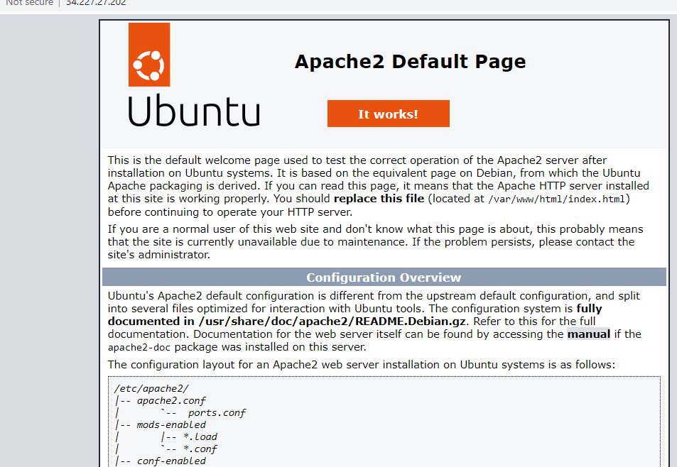
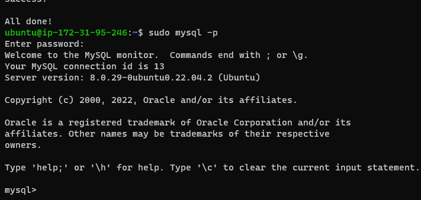
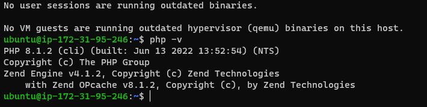

Documentation of Project1

`sudo apt update`

`sudo apt install apache2`

`sudo systemctl status 
apache2`

`sudo apt install mysql-server`

`sudo mysql`

`sudo apt install php libapache2-mod-php php-mysql`

[install openssh](https://docs.microsoft.com/en-us/windows-server/administration/openssh/openssh_install_firstuse)

[open ssh key management](https://docs.microsoft.com/en-us/windows-server/administration/openssh/openssh_keymanagement)
