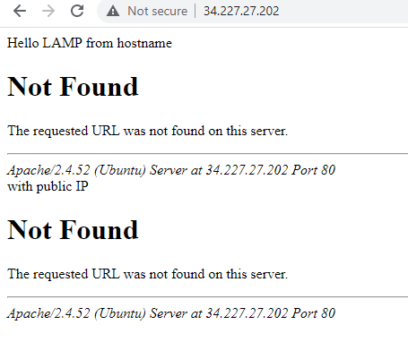

Documentation of Project1

`sudo apt update`

`sudo apt install apache2`

`sudo systemctl status 
apache2`

`sudo apt install mysql-server`

`sudo mysql`

`sudo apt install php libapache2-mod-php php-mysql`

`sudo mkdir /var/www/projectlamp`
`sudo vi /etc/apache2/sites-available/projectlamp.conf`
`<VirtualHost *:80>
   # ServerName projectlamp
   # ServerAlias www.projectlamp 
    ServerAdmin webmaster@localhost
    DocumentRoot /var/www/projectlamp
    ErrorLog ${APACHE_LOG_DIR}/error.log
    CustomLog ${APACHE_LOG_DIR}/access.log combined
</VirtualHost>`
esc
:
w
q
enter

`sudo a2ensite projectlamp`
`sudo a2dissite 000-default`
`sudo apache2ctl configtest`

`sudo echo 'Hello LAMP from hostname' $(curl -s http://34.227.27.202/latest/meta-data/public-hostname) 'with public IP' $(curl -s http://34.227.27.202/latest/meta-data/public-ipv4) > /var/www/projectlamp/index.html`
`http://<Public-IP-Address>:80`

[install openssh](https://docs.microsoft.com/en-us/windows-server/administration/openssh/openssh_install_firstuse)

[open ssh key management](https://docs.microsoft.com/en-us/windows-server/administration/openssh/openssh_keymanagement)
